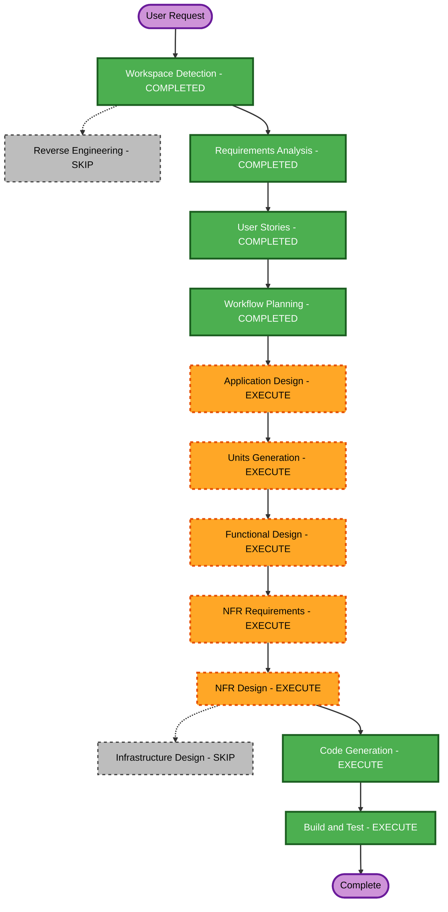

# 执行计划

## 详细分析摘要

### 变更范围与影响

- **项目类型**：Greenfield；无既有代码、数据迁移、API 兼容性或跨包升级。
- **用户影响**：高。所有功能直接决定玩家从首次进入、选择木板、掉水、通关到重玩的体验。
- **结构影响**：高。需要分离纯游戏状态/关卡逻辑、Three.js 场景、React 控制界面、音效与受控错误处理。
- **数据与 API 影响**：无持久化数据模型和后端 API；会话最高分仅为可选的非敏感本地数值。
- **NFR 影响**：高。实时渲染资源清理、静态 Web 安全标头、固定依赖/SRI、供应链检查和完整 PBT 是硬约束。

### 风险评估

- **风险级别**：中等。
- **主要风险**：跳跃落点与移动木板的时间判定、关卡可达性和难度递增、WebGL/React 生命周期清理、CDN 模块的 CSP/SRI 配置。
- **回滚复杂度**：低；静态前端无数据迁移，变更可通过替换版本回退。
- **测试复杂度**：中等至高；需结合示例测试、`fast-check` 状态性质测试和浏览器手动冒烟检查。

## 单元与协调方式

| 单元 | 责任 | 依赖 | 交付顺序 |
|---|---|---|---|
| U1：游戏领域逻辑 | 确定性关卡、可达性、木板运动、状态机、得分、生命和跳跃结算；纯函数与 PBT | 无 | 先完成 |
| U2：浏览器体验与 3D 场景 | React HUD/按钮、Three.js 渲染与拾取、动画、音效、响应式与错误提示 | U1 的稳定领域接口 | 后完成 |

**更新策略**：顺序执行。U1 定义并测试无 UI 副作用的规则与数据契约；U2 只消费这些接口并承担呈现和浏览器资源生命周期。最终执行跨单元集成测试。

## 工作流可视化

### 文本替代图

`请求 → 工作区检测（完成）→ 需求（完成）→ 用户故事（完成）→ 工作流规划（完成）→ 应用设计 → 单元生成 → 每单元功能设计 → NFR 需求 → NFR 设计 → 代码生成 → 构建与测试 → 完成`。

逆向工程和基础设施设计均跳过。

## 阶段决定

### Inception

- [x] 工作区检测：已完成。
- [x] 逆向工程：跳过；Greenfield，无现有源码。
- [x] 需求分析：已完成。
- [x] 用户故事：已完成。
- [x] 工作流规划：已完成。
- [ ] **应用设计：执行**；需定义领域逻辑、渲染、UI、音效和错误边界，以及它们的接口。
- [ ] **单元生成：执行**；确定性算法、状态管理和两个可协调交付单元需要结构化拆分。

### Construction

- [ ] **功能设计：执行（每单元）**；U1 需要状态模型、关卡可达性和 PBT 可识别性质；U2 需要输入、动画和资源清理行为。
- [ ] **NFR 需求：执行（每单元）**；性能、WebGL 生命周期、CSP/SRI、供应链和 `fast-check` 框架选择均须落实。
- [ ] **NFR 设计：执行（每单元）**；需把受控错误、依赖完整性、无障碍、可复现测试和资源释放模式纳入设计。
- [ ] **基础设施设计：跳过**；首版没有云资源、部署自动化或后端。静态托管安全标头作为构建/部署说明中的配置要求交付。
- [ ] **代码生成：执行（每单元）**；为 U1/U2 先创建可审批的实现计划，再生成代码、示例测试和 PBT。
- [ ] **构建与测试：执行**；验证 npm 锁定依赖、单元/PBT、静态服务和浏览器冒烟流程。

### Operations

- [ ] Operations：占位；当前不执行。

## 质量门禁

1. 领域逻辑不可依赖 DOM/Three.js，且使用固定种子可重现。
2. 所有已识别游戏不变量都由 `fast-check` 属性测试覆盖；关键路径同时有示例测试。
3. 运行时无未处理异常、重复动画循环或事件监听器泄漏。
4. 静态部署文档包含 CSP、HSTS、`nosniff`、防嵌入和 Referrer Policy；CDN 版本、完整性复核、锁文件、漏洞扫描和 SBOM 步骤齐全。
5. 在静态 HTTP 服务中验证开始、有效跳跃、掉水、通关、失败、重玩和静音体验。

## 估算

- **待执行阶段数**：7（应用设计、单元生成、3 个每单元设计阶段、代码生成、构建与测试；其中设计与代码生成按 U1/U2 循环）。
- **完成定义**：可运行的单页游戏、已锁定的开发依赖、完整示例测试与 PBT，以及构建/测试/静态托管安全说明。

## 扩展合规预检

| 扩展 | 状态 | 本计划结论 |
|---|---|---|
| Security Baseline | 已启用 | 合规。应用/NFR/代码/构建阶段将验证 SECURITY-04、09、10、11、13、15；无后端范围内的其余规则继续标记 N/A。 |
| Property-Based Testing | 已启用 | 合规。U1 的功能设计须执行 PBT-01；NFR 需求选择固定版本 `fast-check`（PBT-09）；代码和构建阶段执行适用的 PBT-03、05、06、07、08、10。 |
